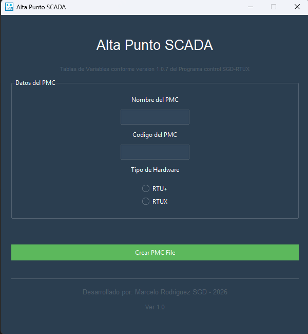

<div align="center">

# Alta Punto SCADA


Aplicacion de escritorio para dar de alta un **PMC** y generar automaticamente sus archivos de trabajo a partir de plantillas locales.

</div>

## Vista rapida

```text
Nombre + Codigo + Hardware -> validacion -> generacion de archivos -> carpeta PMC_Creados/
```

## Captura



## Lo que hace

- Crea una carpeta por cada PMC en `PMC_Creados/`.
- Genera el `.csv` del PMC desde la plantilla de `RTU+` o `RTUX`.
- Crea `OSEDIS_<codigo>.tgd` a partir de `utils/TagGrupo.xlsx`.
- Actualiza `utils/codigosSIM.txt` con los proximos codigos disponibles.
- Registra cada alta en `utils/log.txt`.

## Interfaz

- Ventana principal con tema `superhero`.
- Validacion de datos antes de crear archivos.
- Confirmacion previa a la generacion.
- Mensajes de exito y error integrados.

## Requisitos

- Python 3
- `ttkbootstrap`
- `openpyxl`

## Instalacion

```bash
pip install ttkbootstrap openpyxl
```

## Ejecutar

```bash
python app.py
```

## Uso

1. Abrir la aplicacion.
2. Completar nombre y codigo del PMC.
3. Elegir el tipo de hardware.
4. Confirmar la operacion.
5. Revisar la salida en `PMC_Creados/<Nombre del PMC>/`.

## Archivos necesarios

```text
utils/
├── codigosSIM.txt
├── RTU+.csv
├── RTUX.csv
├── TagGrupo.xlsx
└── logoOSE.ico
```

## Estructura del proyecto

```text
AppAltaScada/
├── app.py
├── README.md
├── docs/
├── utils/
└── PMC_Creados/
```

## Notas

- La aplicacion usa rutas relativas, por lo que debe ejecutarse desde la raiz del proyecto.
- Si falta algun archivo en `utils/`, la generacion fallara y se mostrara un mensaje de error.

## Autor

Desarrollado por Marcelo Rodriguez SGD - 2026
